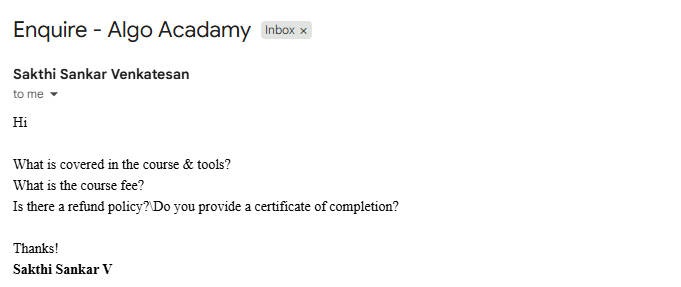
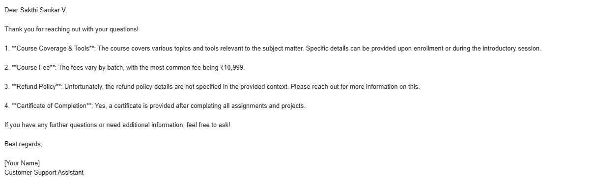
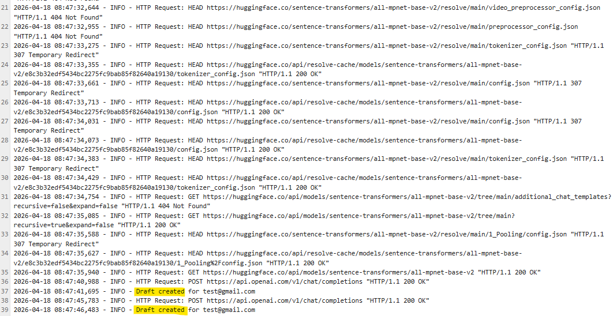

# AI Auto-Reply Email System (RAG + OpenAI + Gmail API)

## Overview
An intelligent customer support automation system that reads emails from Gmail, retrieves relevant knowledge from a PDF-based knowledge base using RAG, and generates contextual replies using OpenAI.
Instead of sending replies automatically, the system creates drafts for human review.

---

## Features
- Reads emails from Gmail API
- RAG-based knowledge retrieval (FAISS)
- AI-generated replies using OpenAI
- Draft creation (human-in-the-loop)
- Retry mechanism for API failures
- Logging system for monitoring
- Secure API key handling (.env)
---

## Architecture
Gmail → RAG (FAISS) → OpenAI → Draft Email

---

## Tech Stack
- Python
- OpenAI (gpt-4o-mini)
- FAISS (Vector DB)
- LangChain
- Gmail API
---

## Project Structure
app/ 
├── gmail_service.py 
├── rag_pipeline.py 
├── llm_service.py 
├── main.py
├── utils.py

---

## 📸 Demo

### 📩 Incoming Email

### 📝 Draft Generated

### 📊 Logs

